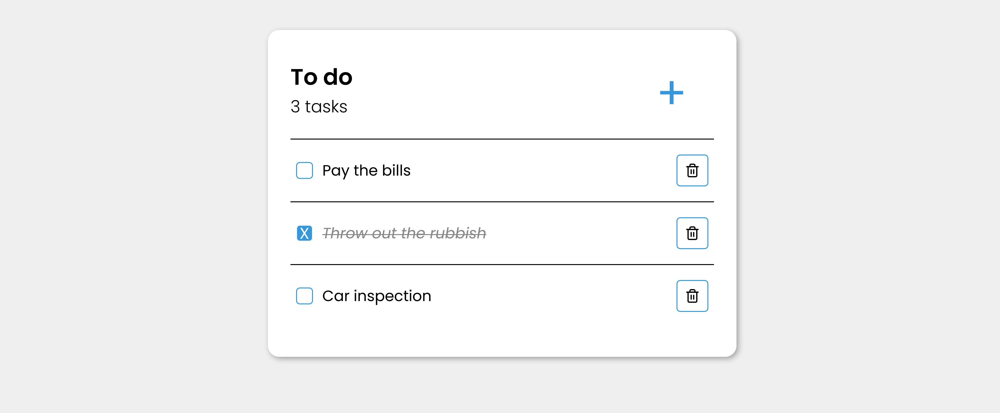

# Todo App

Todo list project was created with Vite+React. This app was written in polish language.

## Technologies

## About the project

This application has the following features:

- **Adding a new task** - to add a new task click on the '+' icon and in the pop-up form enter a task name and click on the 'Dodaj' button or press Enter.
- **Editing a task** - to edit the name of a task just click on the task name, enter a new name and then click on 'Zapisz'.
- **Changing task status (done / undone)** - by clicking on the rectangle next to the task, the task will change status to done or undone.
- **Task counter** - shows the current number of task.
- **Drag and drop functionality** - thanks to the use of <a href = 'https://github.com/atlassian/react-beautiful-dnd'>react-beautiful-dnd</a>, the order of tasks can be changed by simply dragging the todo and dropping it to another place (before or after).
- Local Storage.

## Screenshot

  

  
  

